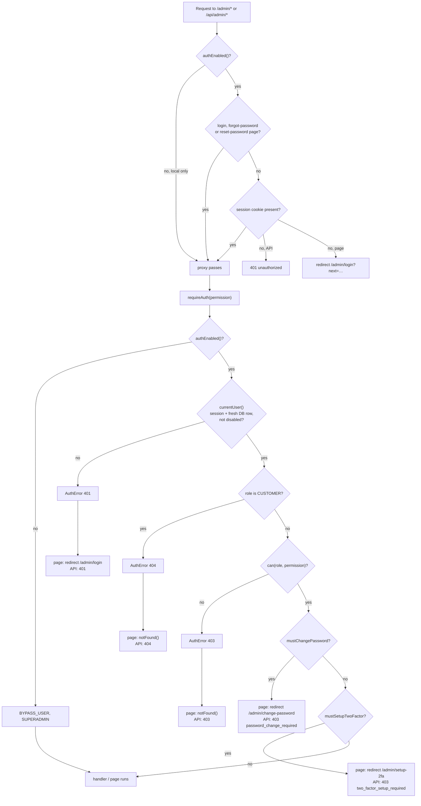
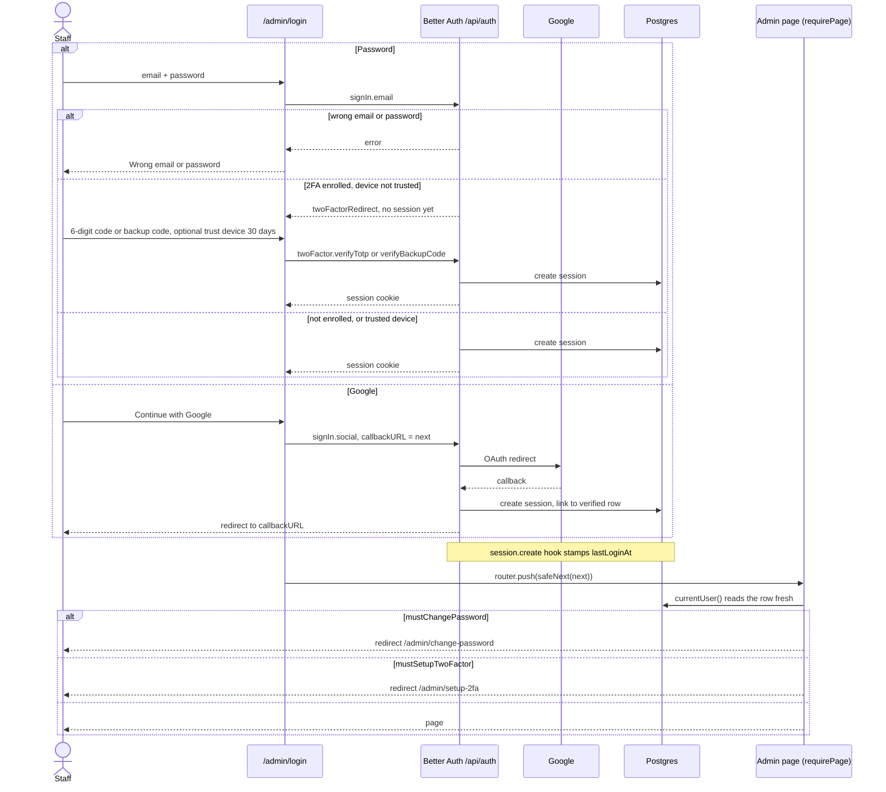
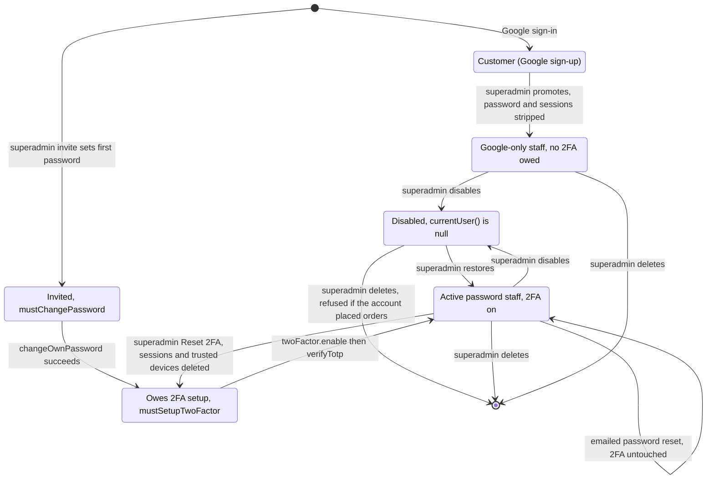
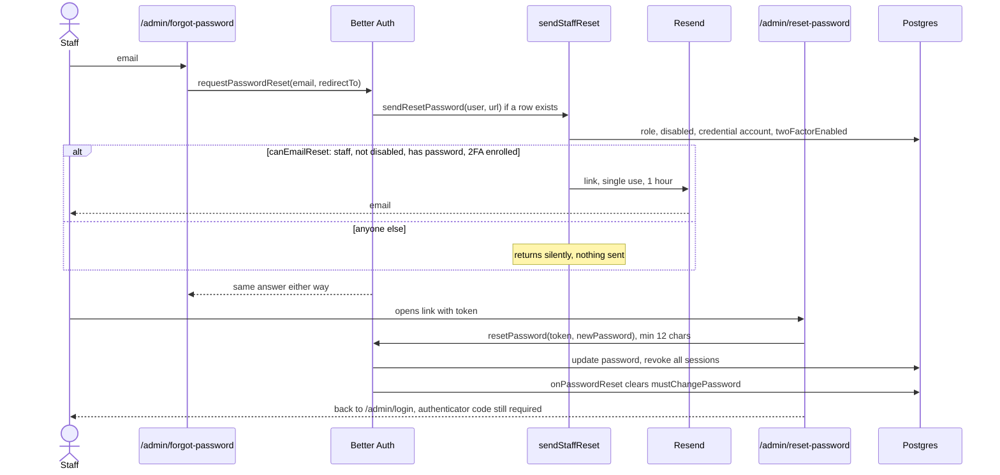
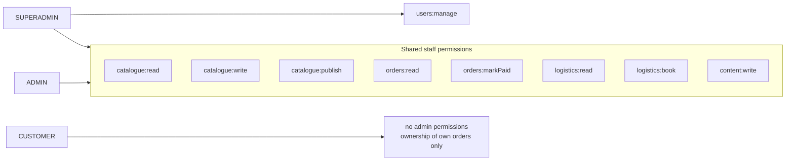
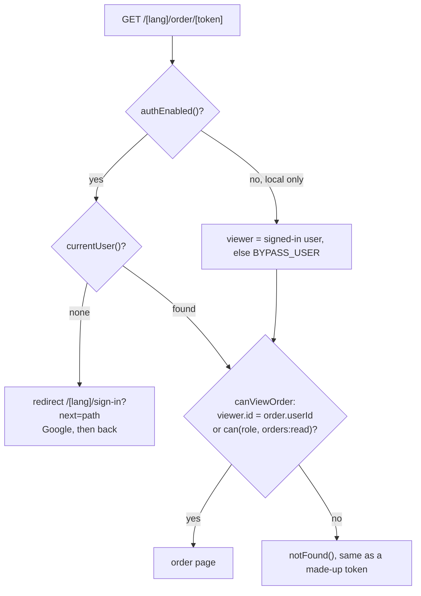

# Auth diagrams

Drawn from the code as of 2026-10-06 (`src/lib/auth.ts`, `src/lib/auth/*`, `src/proxy.ts`).
Prose and reasoning live in `CLAUDE.md` → Auth and `docs/superpowers/specs/2026-09-20-rbac-design.md`,
`2026-10-06-staff-2fa-design.md`.

## 1. Request gate: proxy redirects, `requireAuth` decides

`proxy.ts` never reads the database, so it never knows a role. The boundary is
`requireAuth()`, reached through `withAuth` (API routes) or `requirePage` (pages).

## 2. Staff sign-in

Password accounts meet the code prompt; Google carries its own second factor.
A staff account that has a password but no enrolled authenticator is sent to
`/admin/setup-2fa` whichever door it used, because the gate is keyed on the
account, not the session.

## 3. Staff account lifecycle

Public sign-up only ever produces a `CUSTOMER`. A role is granted only by a
superadmin on `/admin/users`.

Locks on role changes (`roleChangeAllowed`): nobody changes their own role, and
the last superadmin cannot be demoted. Delete (`deleteUser`) is refused on your
own row and on an account with orders; `Order.paidByName` keeps who marked an
order paid. `/two-factor/disable` is closed — only
Reset 2FA removes a second factor.

## 4. Forgot password (staff, emailed link)

Better Auth calls `sendResetPassword` for any address with a user row, so
`canEmailReset` decides who is actually mailed. The page answers the same
sentence either way.

## 5. Roles and permissions

`lib/auth/permissions.ts` is the whole model: a compile-time table, not rows.

## 6. Customer order access

The token in the URL is an address, not a key (`lib/orders/access.ts`).

